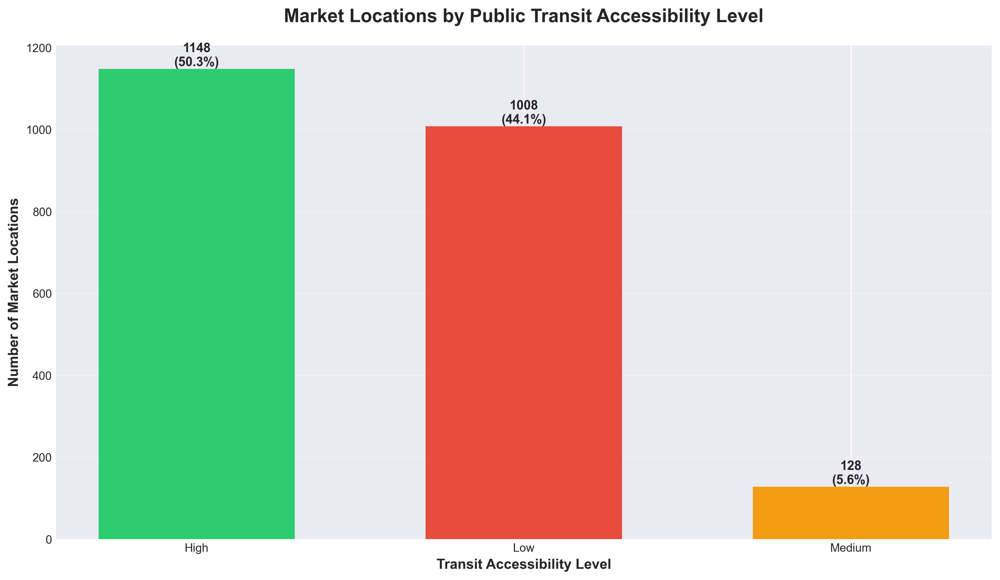
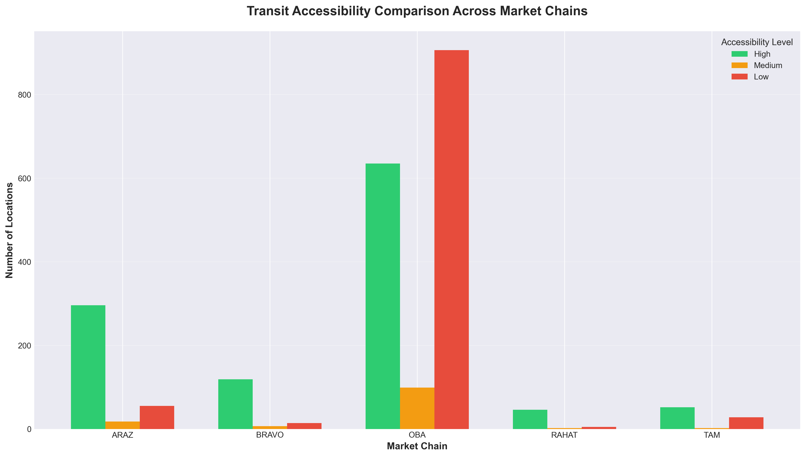
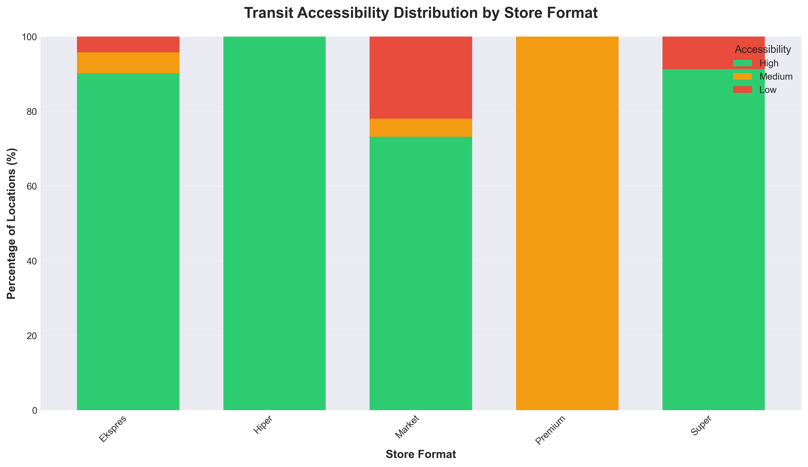
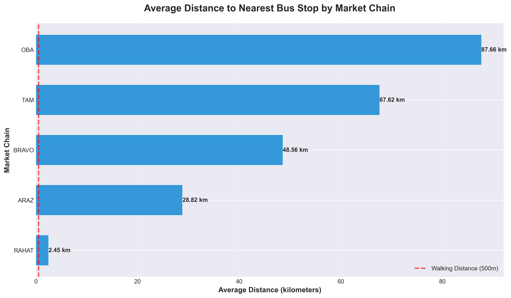
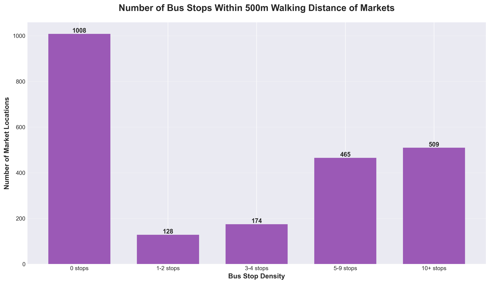
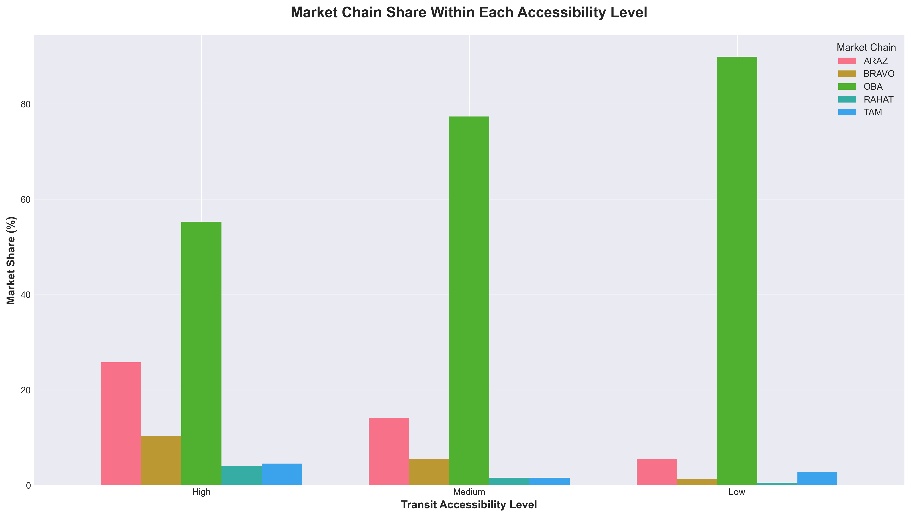
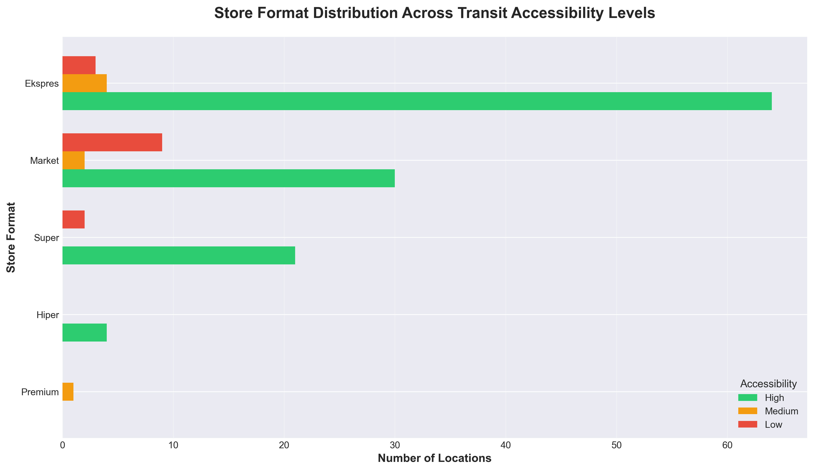
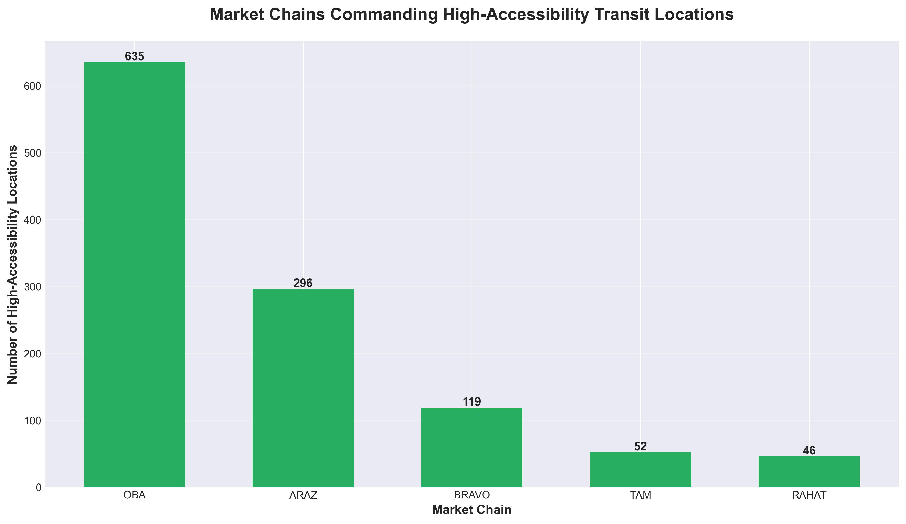
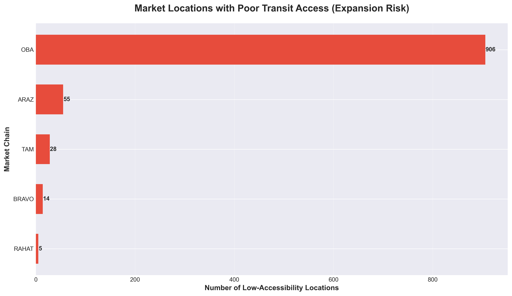
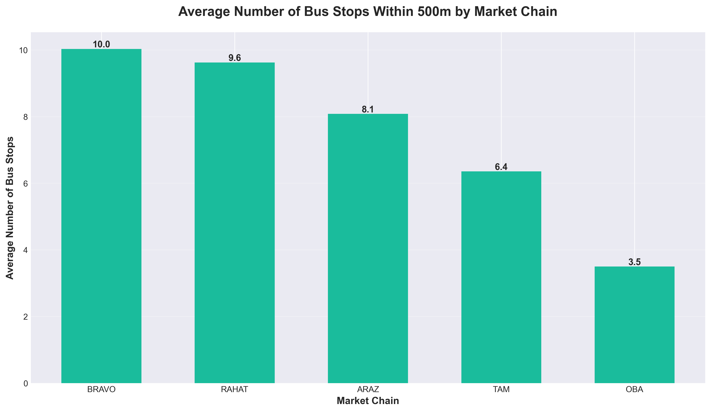

# Public Transit Access Analysis: Impact on Retail Market Performance

**Executive Summary Report**

---

## Overview

This analysis examines the relationship between public transit infrastructure and the strategic positioning of 2,284 retail market locations across five major chains: BRAVO, ARAZ, RAHAT, OBA, and TAM. The study evaluates how proximity to bus routes influences customer accessibility and provides actionable insights for expansion planning, site selection, and competitive positioning.

---

## Key Findings

### 1. **Transit Access Distribution Reveals Market Opportunity**

**What This Shows:**
The retail market network displays a polarized accessibility profile:
- **50.3%** of locations enjoy high transit access (3+ bus stops within 500m walking distance)
- **44.1%** suffer from poor transit access (no nearby bus stops)
- Only **5.6%** fall in the medium accessibility category

**Why This Matters:**
This stark division presents both a strategic advantage and a vulnerability. High-access locations benefit from foot traffic and commuter visibility, while low-access stores depend entirely on vehicle-based customers. The narrow middle ground suggests most locations are either well-integrated into transit networks or completely isolated from them.

**Business Implications:**
- High-access stores can leverage transit advertising and commuter-focused promotions
- Low-access locations may require enhanced parking infrastructure and vehicle-friendly amenities
- The 44% of poorly connected stores represent potential risk if urban transit expansion prioritizes other corridors

---

### 2. **Competitive Positioning: Chain-by-Chain Transit Strategy**

**What This Shows:**
Different chains demonstrate vastly different transit accessibility profiles:

| Chain | High-Access Locations | Average Distance to Transit |
|-------|----------------------|----------------------------|
| **RAHAT** | 86.8% | 2.45 km |
| **BRAVO** | 85.0% | 48.56 km |
| **ARAZ** | 80.2% | 28.82 km |
| **TAM** | 63.4% | 67.62 km |
| **OBA** | 38.7% | 87.66 km |

**Why This Matters:**
RAHAT, BRAVO, and ARAZ have built strong transit-oriented networks, positioning themselves to capture commuter traffic and urban shoppers. In contrast, OBA has adopted a suburban/rural strategy with only 39% of stores near transit hubs.

**Business Implications:**
- **For RAHAT/BRAVO/ARAZ:** Capitalize on transit access through express formats, grab-and-go offerings, and extended commuter hours
- **For OBA:** Consider this a differentiation strategy targeting car-dependent customers with larger basket sizes and family shopping trips
- **For TAM:** The moderate position suggests room to either double down on transit locations or pivot toward suburban expansion

**Strategic Recommendation:**
Market leaders should not assume transit access is universally desirable. The success of OBA's low-transit strategy may reflect deliberate positioning in underserved suburban markets with higher household purchasing power.

---

### 3. **Store Format Strategy: Transit Access by Size**

**What This Shows:**
- **Hiper** (large hypermarkets): 100% have high transit access
- **Ekspres** (convenience stores): 90.1% have high transit access
- **Super** (supermarkets): 91.3% have high transit access
- **Market** (small markets): 73.2% have high transit access

**Why This Matters:**
The data reveals a clear hierarchy: larger formats cluster near transit hubs, while smaller neighborhood markets tolerate lower accessibility. This suggests that high-investment flagship stores require transit-driven foot traffic to justify their footprint, whereas smaller markets serve residential catchment areas regardless of transit.

**Business Implications:**
- When planning new **Hiper or Super** formats, transit access should be a non-negotiable site selection criterion
- **Ekspres** stores are ideally positioned as commuter convenience outlets near transit stations
- **Market** formats offer flexibility to penetrate residential neighborhoods with weak transit but strong local demand

**Strategic Recommendation:**
For chains expanding into secondary cities or suburban areas, the Market format provides a lower-risk entry strategy that does not depend on mature public transit infrastructure.

---

### 4. **Site Selection Benchmark: Average Distance to Transit**

**What This Shows:**
RAHAT operates the most transit-optimized network with stores averaging just **2.45 km** from the nearest bus stop. OBA stores average **87.66 km** from transit, confirming their rural/exurban focus.

**Why This Matters:**
This metric is a proxy for strategic intent:
- **Low average distance** = urban-focused, transit-dependent customer base
- **High average distance** = suburban/rural focus, car-dependent customer base

**Business Implications:**
- RAHAT's proximity advantage allows for same-day delivery partnerships with transit agencies or micro-fulfillment hubs at transit stations
- OBA's distance profile suggests they should invest in ample parking, drive-through services, and bulk purchase incentives
- Chains with high variance (like BRAVO and ARAZ) run a mixed portfolio, which may dilute brand identity unless distinct sub-formats are deployed

**Strategic Recommendation:**
Conduct customer segmentation analysis to determine whether transit-proximate and transit-distant stores exhibit different purchasing patterns, basket sizes, and peak shopping hours. Tailor operations accordingly.

---

### 5. **Bus Stop Density: Measuring Transit Saturation**

**What This Shows:**
- **1,008 stores** (44%) have **zero bus stops** within 500m
- **974 stores** (43%) have **5 or more stops** nearby, indicating transit hubs

**Why This Matters:**
The market network is not moderately distributed—it's bimodal. Nearly half the stores are transit deserts, while the other half are transit-rich. This creates two distinct customer personas:
1. **Transit-dependent commuters** (urban, frequent, small baskets)
2. **Car-dependent families** (suburban, weekly, large baskets)

**Business Implications:**
- Transit-rich stores should optimize for quick transactions, ready-to-eat meals, and personal care items
- Transit-poor stores should emphasize bulk discounts, loyalty programs, and extended weekend hours for family shopping trips

**Strategic Recommendation:**
Map promotional strategies to transit density. High-density locations benefit from weekday commuter promotions, while low-density locations should focus on weekend family deals.

---

### 6. **Market Share Analysis: Who Dominates High-Access Locations?**

**What This Shows:**
Within high-accessibility zones, ARAZ and BRAVO command the largest share of locations, while OBA and TAM are stronger in low-accessibility areas.

**Why This Matters:**
This reveals competitive battlegrounds:
- **Urban transit corridors** are dominated by ARAZ and BRAVO
- **Suburban/rural areas** are dominated by OBA

**Business Implications:**
- For new entrants or smaller chains: Breaking into high-access urban markets requires competing directly with established players (ARAZ, BRAVO)
- For established chains: Defend high-access locations aggressively; they represent scarce, high-value real estate
- Acquisition targets should be evaluated based on whether they strengthen or dilute your transit access profile

**Strategic Recommendation:**
If urban density is a strategic priority, consider acquiring smaller chains with strong transit-adjacent portfolios rather than building from scratch.

---

### 7. **Format Distribution: Where Each Store Type Thrives**

**What This Shows:**
- **Ekspres** stores dominate high-accessibility zones (71 locations)
- **Market** and **Super** formats are more evenly distributed across accessibility levels
- **Hiper** formats are exclusively in high-access areas (4 locations, all well-connected)

**Why This Matters:**
This confirms that format strategy is tightly coupled to transit access:
- Convenience stores (Ekspres) need commuter traffic
- Hypermarkets (Hiper) need transit access to justify large-scale operations
- Mid-size stores (Market/Super) are versatile

**Business Implications:**
- Do not deploy Ekspres formats in low-transit areas—they will underperform
- Hiper formats require transit infrastructure as a precondition for success
- Market/Super formats are the safest bet for uncertain or transitional locations

---

### 8. **Competitive Advantage: High-Accessibility Market Leaders**

**What This Shows:**
ARAZ leads with the most high-accessibility locations, followed closely by BRAVO and RAHAT.

**Why This Matters:**
These chains have locked in premium transit-adjacent real estate, creating a durable competitive moat. New competitors will struggle to find equivalent sites without significant capital investment or acquisitions.

**Business Implications:**
- **For market leaders (ARAZ, BRAVO, RAHAT):** Protect these assets through long-term leases and continuous reinvestment
- **For challengers (OBA, TAM):** Consider that competing head-to-head for transit locations may be cost-prohibitive; differentiate through suburban dominance instead
- **For investors:** High-access location portfolios represent tangible competitive advantages that should command premium valuations

**Strategic Recommendation:**
Benchmark your portfolio against competitors. If you're underweight in high-access locations, consider:
1. Acquiring distressed competitors with strong transit assets
2. Partnering with transit authorities for co-located retail spaces
3. Accepting lower initial margins to secure strategic transit-adjacent sites

---

### 9. **Risk Exposure: Stores with Poor Transit Access**

**What This Shows:**
OBA has the most low-accessibility locations (440), followed by ARAZ (179) and TAM (139).

**Why This Matters:**
These stores face potential risks if:
- Urban planning shifts toward transit-oriented development
- Fuel prices rise, discouraging car-dependent shopping
- Environmental regulations restrict private vehicle access

**Business Implications:**
- **For OBA:** This is a strategic choice, not a weakness—but monitor trends in rural-to-urban migration and fuel costs
- **For ARAZ and TAM:** The mix of high-access and low-access stores suggests portfolio balance, but ensure low-access locations justify themselves through profitability metrics
- **For all chains:** Stress-test low-access stores against scenarios like congestion pricing, carbon taxes, or expanded transit networks that bypass them

**Strategic Recommendation:**
Evaluate whether low-access stores compensate for transit disadvantages through other strengths (parking, drive-throughs, larger selection). If not, consider divestment or format conversion.

---

### 10. **Transit Stop Density by Chain: Operational Intensity**

**What This Shows:**
ARAZ, BRAVO, and RAHAT stores average **4-6 bus stops** within 500m, while OBA and TAM average **2-3 stops**.

**Why This Matters:**
Higher stop density correlates with:
- Greater commuter visibility
- More frequent foot traffic
- Shorter customer dwell times (quick trips vs. planned shopping)

**Business Implications:**
- Chains with high stop density should optimize for transaction speed: self-checkout, mobile payment, grab-and-go aisles
- Chains with low stop density can afford longer customer journeys: in-store sampling, wider aisles, full-service departments

**Strategic Recommendation:**
Align store layouts and staffing models to transit density. High-density stores benefit from lean, fast operations. Low-density stores benefit from enhanced customer service.

---

## Strategic Recommendations

### For Market Leaders (ARAZ, BRAVO, RAHAT)
1. **Defend and expand transit-adjacent portfolios** through long-term site control
2. **Launch transit-specific formats** (e.g., micro-markets inside transit stations)
3. **Partner with transit operators** for co-branded loyalty programs

### For Suburban Specialists (OBA, TAM)
1. **Double down on car-dependent amenities**: drive-throughs, ample parking, bulk offerings
2. **Target secondary cities** where transit networks are underdeveloped
3. **Monitor demographic shifts**: if urbanization accelerates, pivot toward mixed-use developments

### For All Chains
1. **Conduct profitability segmentation** by transit access level—identify whether high-access stores justify premium rents
2. **Test dynamic pricing and promotions** tailored to transit vs. non-transit customer behavior
3. **Prepare for transit expansion**: identify corridors where new bus routes or metro lines are planned and secure sites proactively

---

## Conclusion

Public transit access is not merely a convenience factor—it is a **strategic asset** that shapes customer demographics, shopping behaviors, and competitive positioning. The data reveals clear winners (RAHAT, BRAVO, ARAZ) who have built dense urban networks, and deliberate differentiators (OBA) who have staked claim to suburban, car-dependent markets.

The polarized nature of transit access (50% high, 44% low, 6% medium) suggests that **incremental improvements will not move the needle**. Strategic decisions must be bold: either commit to transit-oriented urban density or embrace suburban dominance.

The next phase of competition will be defined by:
- **Land scarcity** in high-access zones
- **Regulatory shifts** favoring transit-oriented development
- **Changing consumer preferences** around sustainability and car ownership

Chains that align their format strategy, site selection, and operational model with their transit accessibility profile will capture outsized market share. Those that ignore this dimension risk being caught in the middle—neither fish nor fowl—and losing to more focused competitors.

---

**Report Generated:** February 2026
**Analysis Scope:** 2,284 market locations, 208 bus routes, 3,841 bus stops
**Charts:** 10 business intelligence visualizations (charts/ directory)
**Script:** Automated analysis pipeline (scripts/generate_charts.py)
